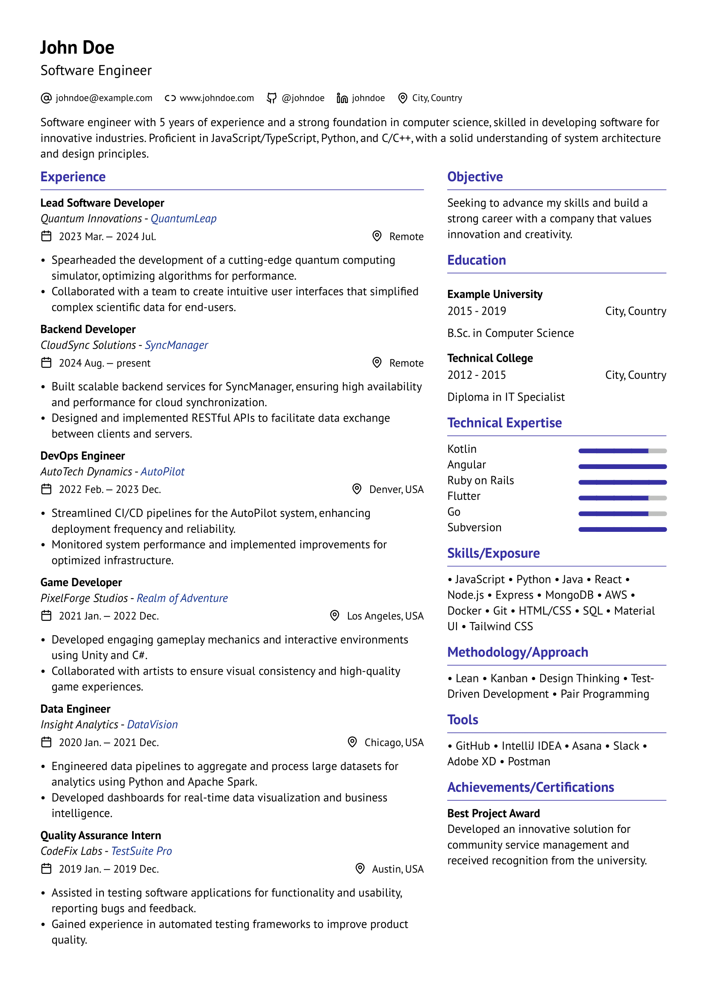

# Vantage Typst

An ATS friendly simple Typst CV template, inspired by [alta-typst by George Honeywood](https://github.com/GeorgeHoneywood/alta-typst). See [`example.pdf`](example.pdf) for the rendered PDF output.



## Features

- **Two-column layout**: Experience on the left and other important details on the right, organized for easy scanning.
- **Customizable icons**: Add and replace icons to suit your personal style.
- **Responsive design**: Adjusts well for various print formats.

## Usage

### Running Locally with Typst CLI

1. **Install Typst CLI**: Follow the installation instructions on the [Typst CLI GitHub page](https://github.com/typst/typst#installation) to set up Typst on your machine.

2. **Clone the repository**:

   ```bash
   git clone https://github.com/sardorml/vantage-typst.git
   cd vantage-typst
   ```

3. **Instalation**:

Fedora Installation:

   ```bash
   sudo dnf copr enable claaj/typst
   dnf install typst
   ```

4.  **Run Typst**:

    Use the following command to render your CV:

   ```bash
    typst compile --font-path ./fonts/ ./myTemplate/myTemplate.typ --root .
   ```


    This will generate a PDF output in the same directory.

    ```

5.  **Edit your CV**:

    Open the `example.typ` file in your preferred text editor to customize the layout.

### Configuration

You can easily customize your personal data by editing the `configuration.yaml` file. This file allows you to set your name, contact information, work experience, education, and skills. Here’s how to do it:

1. Open the `configuration.yaml` file in your text editor.
2. Update the fields with your personal information.
3. Save the file, and your CV will automatically reflect these changes when you compile it.

## Icons

You can enhance your CV with additional icons by following these steps:

1. **Upload Icons**: Place your `.svg` files in the `icons/` folder.

2. **Reference Icons**: Modify the `links` array in the Typst file to include your new icons by referencing their filenames as the `name` values.

   Example:

   ```typst
   links: [
     { name: "your-icon-name", url: "https://example.com" },
   ]
   ```

For existing icons, the current selection is sourced from [Lucide Icons](https://lucide.dev/icons/).

## License

This project is licensed under the [MIT License](./LICENSE).

Icons are from Lucide Icons and are subject to [their terms](https://lucide.dev/license).

## Acknowledgments

- Inspired by the work of [George Honeywood](https://github.com/GeorgeHoneywood/alta-typst).
- Thanks to [Lucide Icons](https://lucide.dev/icons/) for providing the icon library.

For any questions or contributions, feel free to open an issue or submit a pull request!
